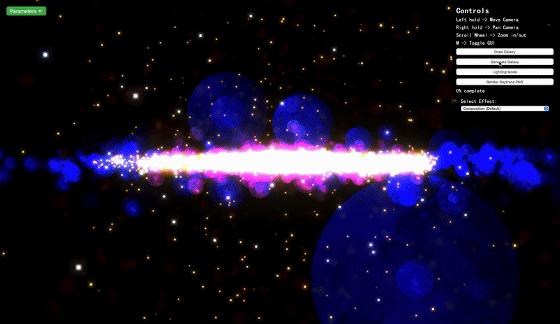
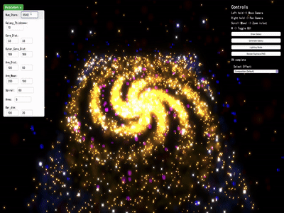
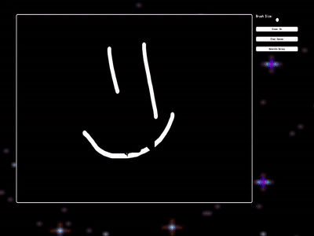
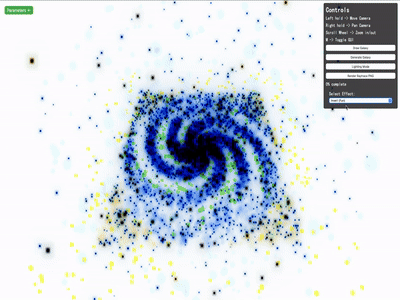
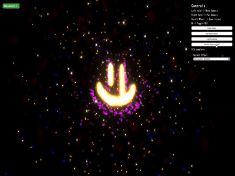
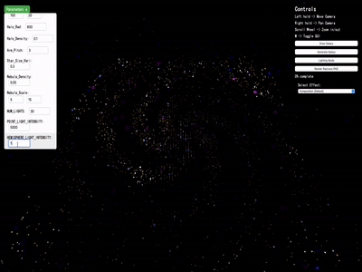
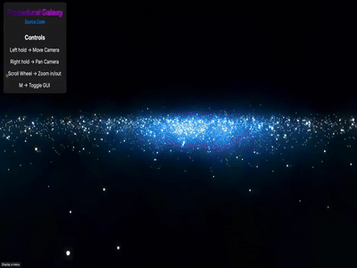

# Procedurally Generated Galaxy in Three.js

## Overview

This project is a final work for the CS184 computer graphics course at UC Berkeley, [where our work became part of the final showcase](https://cs184.eecs.berkeley.edu/su25/project/showcase/). It launches a real-time, interactive render of a galaxy with procedurally generated objects like stars and nebulas. The user can create a galaxy by drawing it on a 2D canvas, apply artistic effects, enter a special lighting mode, and generate a raytraced PNG render. The project report for CS184 can be found [here](https://m7tro.github.io/galaxy184_final_deliverable_deploy/).

You can see the demo [here](https://m7tro.github.io/galaxy_editor_cs184/)



## Features

- **Procedural generation**: Procedurally generated stars with adjustable density, distribution, galaxy thicnkess and more!


- **2D Canvas**: Draw a shape and we will turn it into a galaxy!


- **Artistic effects**: Apply artistic post-processing shaders that can turn your galaxy black-and-white!


- **Ray tracing**: Generate a PND created by ray tracing with BVH acceleration that uses a sphere-representation of a galaxy


- **Lighting Mode**: A special lighting mode that lets you set up light sources within your galaxy


- **Realistic Rotation**: Realistically looking rotation of stars that compose the galaxy
- **Interactive Camera**: Pan, zoom, and rotate to explore the galaxy.
- **Different objects**: Stars, haze, nebulas

## Technologies Used

- **Three.js**: Core library for 3D rendering and visualization.
- **JavaScript**: Main programming language for procedural algorithms and interactivity.
- **HTML/CSS**: Basic structure and styling of the application. 

### Prerequisites

- Node.js (for running a local development server)
- A modern web browser (e.g., Chrome, Firefox, Edge) with WebGL support

### Installation

1. Clone the repository:

   ```bash
   git clone git@github.com:M7Tro/galaxy_editor_cs184.git
   ```

2. Navigate to the project directory:

   ```bash
   cd galaxy_editor_cs184
   ```

3. Start live server via vscode live server (or http server)

4. Open your browser and go to the address generated by the live server

### Customization

The galaxy parameters can be modified directly in the JavaScript configuration file (`config/galaxyConfig.js`). Examples of the parameters include:

- **Galaxy thickness**: Adjust the overall radius of the galaxy.
- **Number of stars**: Set the number of stars to render.
- **Color Schemes**: Define custom colors for stars and nebulae. 

### Controls

- **Mouse Wheel**: Zoom in/out.
- **Left Click + Drag**: Rotate the galaxy.
- **Right Click + Drag**: Pan the camera. 


## Acknowledgments

- The project was started with the great work from the work of [Eric Lin](https://github.com/ericafk0001/threejs-procedral-galaxy#).



- [Three.js Documentation](https://threejs.org/docs/)

---